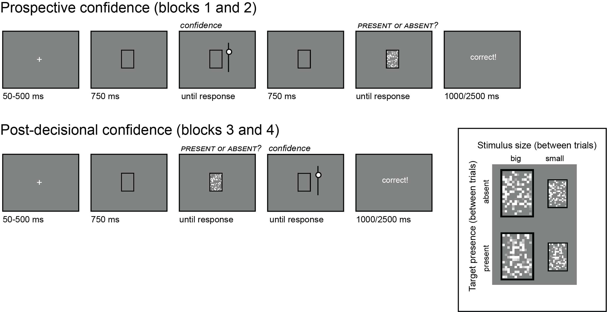

```{r setup, include = FALSE}
library('groundhog')
groundhog.library(
  c(
    'papaja', #for apa formatting
    'pwr', # for power calculation
    'tidyverse',
    'psych'# for pipe %>%
  ), "2025-01-01"
)

r_refs("r-references.bib")
knitr::opts_chunk$set(echo = FALSE)
```

```{r analysis-preferences}
# Seed for random number generation
set.seed(42)
knitr::opts_chunk$set(cache.extra = knitr::rand_seed, include=FALSE,echo=FALSE)
```

# Motivation

In a previous experiment, participants performed a letter detection task.
On different trials, a target letter could be present or absent in a noisy display, which could be big or small.
We found that confidence in decisions about absence reflected participants’ reported belief that visibility should be higher when stimuli are bigger.
Confidence in presence, on the other hand, tracked the true effect of stimulus size on target visibility, which was higher for smaller stimuli.
Here we more directly test the hypothesis that confidence in absence reflects participants’ belief that they would have been able to see the target if it was present, by comparing post-decisional confidence in absence with prospective confidence, in the same task.

# Methods

We report how we determined our sample size, all data exclusions (if any), all manipulations, and all measures in the study.
<!-- 21-word solution (Simmons, Nelson & Simonsohn, 2012; retrieved from http://ssrn.com/abstract=2160588) -->

## Participants

This research complies with all relevant ethical regulations and was approved by the Medical Sciences Interdivisional Research Ethics Committee at the University of Oxford (Ethics Approval Reference R91912/RE001).
Participants will be recruited via Prolific and will give informed consent prior to their participation.
We will stop data collection once we reach 130 included participants (after applying our pre-registered exclusion criteria).
The study will take 15 minutes to complete, and participants will be paid £2.25 for their participation.
This is equivalent to an hourly wage of £9.00.

## Procedure

Participants will detect the presence or absence of a target letter (S or A, in different blocks) in a patch of dynamic grayscale noise presented at 15 frames per second. In each frame, noise will be generated by randomly sampling grayscale values from a target image $I$. Specifically, for each pixel $S_{ij}$, we will display the grayscale value for the corresponding pixel in the original image $I_{ij}$ with some probability $p$, and the grayscale value of a randomly chosen pixel $I_{i\prime j\prime}$ with probability $1-p$. On target-absent trials, $p$ will be set to 0, such that the grayscale values of all pixels will be randomly shuffled. On target-present trials, $p$ will be set to 0.35. Responses will be delivered using the F and G keyboard keys, and response-mapping will be counterbalanced across subjects.

```{r design, echo=FALSE, fig.cap="Experimental design. Trial structure in the main blocks of the experiment, in prospective and post-decisional confidence blocks. In frame: the four stimulus classes: big absent, big present, small absent, and small present.", out.width = '75%'}

```

After reading the instructions, participants will complete four practice trials.
In case their accuracy in these four trials falls below 3/4, they will be reminded of task instructions and given additional practice trials, until they reach the desired accuracy level.
Then, they will complete another four trials to practice rating their prospective confidence by moving a dial on a vertical continuous scale, after which they will be asked a multiple-choice comprehension question.
If their answer to this question is incorrect, they will be reminded of the instructions and repeat the process until they answer it correctly, up to a maximum of two repetitions. Participants who require more than two repetitions will be redirected back to Prolific and their data will not be analysed.
Upon answering correctly, participants will they continue to the main part of the experiment.
Here, their task will be exactly the same, but the noisy stimulus will be either smaller or larger (pixel size factor 3 or 5, on different trials within the same block; see Fig. 1).

After two blocks, participants will be instructed about post-decisional confidence ratings.
Again, they will complete four practice trials and answer a multiple-choice comprehension question.
If their answer to this question is incorrect, they will be reminded of the instructions and repeat the process until they answer it correctly. Participants who require more than two repetitions will be redirected back to Prolific and their data will not be analysed.
Upon answering correctly, participants will they continue to the second half of the experiment.

The main part of the experiment will comprise four blocks of 8 trials. For half of the participants, the target letter will be A on blocks 1 and 3, and S on blocks 2 and 4. For the other half, the target letter will be A on blocks 2 and 4 and S on blocks 1 and 3. 

After completing the four blocks, participants will receive a multiple-choice question:

> Sometimes the display would appear smaller, and sometimes bigger.
> Did you feel this had any effect on how difficult it was to spot the letter?
>
> a.  Yes! It was harder when the display was smaller.
> b.  Yes! It was harder when the display was bigger.
> c.  No! The size of the display had no effect on how difficult it was to spot the letter.

## Randomization

The order and timing of experimental events, as well as the luminance values of pixels within a trial, will be determined pseudo-randomly by the Mersenne Twister pseudorandom number generator, initialized in a way that ensures registration time-locking [@mazor_novel_2019].

# Data analysis

```{r Load and process, echo=FALSE,include=FALSE}
#load
# Set the root directory
root_dir <- "../../../experiments/prospectiveFirst/data/jatos_results_data_pilot3"

# Get a list of all "data.txt" files in the subdirectories
file_paths <- list.files(root_dir, pattern = "data.txt", recursive = TRUE, full.names = TRUE)

# Initialize empty data frames for concatenation
pilot.df <- data.frame()
pilot.comments.df <- data.frame()

# Loop through each file
for (file in file_paths) {
  print(paste("Processing:", file))
  raw_data <- read.csv(file, sep = ",", header = TRUE)
  
  # Check the comprehension condition
  if (raw_data$comprehension[1] == 'true') {
    
    # Extract comments (temporary name: comments_data)
    comments_data <- raw_data %>%
      dplyr::select(-presented_pixel_data) %>%
      dplyr::filter(trial_type == 'survey-text') %>%
      dplyr::select(response)
    
    # Append to the combined comments data frame (pilot.comments.df)
    pilot.comments.df <- bind_rows(pilot.comments.df, comments_data)
    
    # Extract main data (temporary name: main_data)
    main_data <- raw_data %>%
      dplyr::select(-presented_pixel_data) %>%
      dplyr::mutate(
        subj_id = PROLIFIC_PID,
        correct = as.numeric(as.logical(correct)),
        RT = as.numeric(RT),
        confidence = as.numeric(confidence),
        present = as.numeric(present),
        resp = response == presence_key,
        size = factor(ifelse(pixel_size_factor == '3', 'small', 'big'), levels = c('big', 'small'))
      ) %>%
      filter(!(subj_id %in% c('PROLIFIC_PID', ''))) %>%
      dplyr::filter(test_part == 'test1') %>%
      dplyr::select(subj_id, size, confidence, correct, RT, confidence_time, confidence_RT, present, resp, target)
    
    # Append to the combined main data frame (pilot.df)
    pilot.df <- bind_rows(pilot.df, main_data)
  }
}

# View the concatenated results
print("Combined Main Data Frame (pilot.df):")
print(pilot.df)

print("Combined Comments Data Frame (pilot.comments.df):")
print(pilot.comments.df)

pilot.low_accuracy <- pilot.df %>% 
  group_by(subj_id) %>%
  dplyr::summarise(correct=mean(correct)) %>%
  dplyr::filter(correct<0.5) %>%
  dplyr::pull(subj_id)

pilot.too_slow <- pilot.df %>%
  group_by(subj_id) %>%
  dplyr::summarise(
    third_quartile_RT = quantile(RT,0.75)) %>%
  dplyr::filter(third_quartile_RT>7000) %>%
  dplyr::pull(subj_id)

pilot.too_fast <- pilot.df %>%
  group_by(subj_id) %>%
  dplyr::summarise(
    first_quartile_RT = quantile(RT,0.25)) %>%
  dplyr::filter(first_quartile_RT<100) %>%
  dplyr::pull(subj_id)

pilot.to_exclude <- c(
  pilot.low_accuracy,
  pilot.too_slow,
  pilot.too_fast
) %>% unique()

pilot.df <- pilot.df %>%
  dplyr::filter(!(subj_id %in% pilot.to_exclude))

```

## Rejection criteria

Participants will be excluded if their accuracy falls below 50%.
Participants will also be excluded if they have extremely fast or slow reaction times (below 100 milliseconds or above 7 seconds in more than 25% of the trials).
Trials with reaction times below 100 milliseconds or above 7 seconds will be excluded from the reaction time analysis.

## Hypotheses and analysis plan

This study is designed to test whether expected visibility impacts participants’ decisions about presence and absence.

```{r H1, echo=FALSE, cache=TRUE}
resp_RT <- pilot.df %>%
  dplyr::filter(RT > 100 & RT < 7000 & correct == TRUE) %>%  
  dplyr::group_by(subj_id, resp) %>%
  dplyr::summarise(RT = median(RT)) %>%
  tidyr::pivot_wider(names_from = resp, values_from = RT) %>%
  dplyr::mutate(resp_RT = `TRUE` - `FALSE`)
t.test(resp_RT$resp_RT)
```

*Hypothesis 1 (PRESENCE/ABSENCE RESPONSE TIME)*: We will test the null hypothesis that response times are similar for target-present and target-absent responses, aiming to replicate the finding that decisions about the target-absence are slower than decisions about target-presence [@mazor_metacognitive_2021].
This will be tested using a paired t-test on the median individual-level reaction times from correct trials only.

```{r H2, echo=FALSE, cache=TRUE}
RT_present <- pilot.df %>% 
  dplyr::filter(RT > 100 & RT < 7000 & present == 1 & correct == TRUE) %>%
  dplyr::group_by(subj_id, size) %>%
  dplyr::summarise(RT = median(RT))%>%
  tidyr::pivot_wider(names_from = size, values_from = RT) %>%
  dplyr::mutate(RT_present = `big` - `small`)
t.test(RT_present$RT_present)
```

*Hypothesis 2 (SIZE EFFECT ON REACTION TIME IN PRESENCE)*: We will test the null hypothesis that target-present response times are similar when the display is big and small.
This will be tested using a paired t-test on the median individual-level reaction times from correct trials only.

```{r H3, echo=FALSE, cache=TRUE}
RT_absent <- pilot.df %>%
  dplyr::filter(RT > 100 & RT < 7000 & present == 0 & correct == TRUE) %>%
  dplyr::group_by(subj_id, size) %>%
  dplyr::summarise(RT = median(RT))%>%
  tidyr::pivot_wider(names_from = size, values_from = RT) %>%
  dplyr::mutate(RT_absent = `big` - `small`)
t.test(RT_absent$RT_absent)
```

*Hypothesis 3 (SIZE EFFECT ON REACTION TIME IN ABSENCE)*: We will test the null hypothesis that target-absent response times are similar when the display is big and small.
This will be tested using a paired t-test on the median individual-level reaction times from correct trials only.

```{r H4, echo=FALSE, cache=TRUE}
RT_size_resp <- inner_join(
  RT_present %>%
    dplyr::select(subj_id,RT_present),
  RT_absent %>%
    dplyr::select(subj_id,RT_absent),
  by = "subj_id") %>%
  mutate(RT_size_resp = RT_present - RT_absent)
t.test(RT_size_resp$RT_size_resp) 
```

*Hypothesis 4 (SIZE RESPONSE INTERACTION ON REACTION TIME)*: We will test the null hypothesis that the effect of stimulus size on reaction time is similar in target-absent and target-present responses.
This will be tested using a group-level t-test on a subject-level contrast in correct trials only: $(median(RT_{P,small})-median(RT_{P,big}))-(median(RT_{A,small})) -median(RT_{A,big}))$ where P and A stand for present and absent respectively.

```{r H5, echo=FALSE, cache=TRUE}
accuracy <- pilot.df %>%
  dplyr::group_by(subj_id, size) %>%
  dplyr::summarise(
    hit_rate =(sum(correct & present)+0.5)/(sum(present)+1),
    fa_rate = (sum(!correct & !present)+0.5)/(sum(!present)+1),
    dprime = qnorm(hit_rate)-qnorm(fa_rate),
    criterion = -0.5*(qnorm(hit_rate)+qnorm(fa_rate)))

dprime <- accuracy %>%
  dplyr::select(subj_id,size,dprime) %>%
  tidyr::pivot_wider(names_from=size, values_from=dprime) %>%
  dplyr::mutate(dprime_size=`big`-`small`)
t.test(dprime$dprime_size)
```

*Hypothesis 5 (SENSITIVITY)*: We will test the null hypothesis that perceptual sensitivity (measured as $d'=zH-zF$) is equal as a function of the size of the stimulus.
To allow the extraction of d’ for participants who committed no false-alarms or misses, we will add 0.5 to miss, hit, false-alarm and correct rejection counts [@snodgrass_pragmatics_1988].

```{r H6, echo=FALSE, cache=TRUE}
criterion <- accuracy %>%
  dplyr::select(subj_id,size,criterion) %>%
  tidyr::pivot_wider(names_from=size, values_from=criterion) %>%
  dplyr::mutate(criterion_size=`big`-`small`)
t.test(criterion$criterion_size)
```

*Hypothesis 6 (CRITERION)*: We will test the null hypothesis that decision criterion (measured as $c=-0.5zH+zF$) is unaffected by the size of the display.
To allow the extraction of a decision criterion for participants who committed no false-alarms or misses, we will add 0.5 to miss, hit, false-alarm and correct rejection counts [@snodgrass_pragmatics_1988].

```{r H7, echo=FALSE, cache=TRUE}
resp_conf <- pilot.df %>%
  dplyr::filter(correct == TRUE & confidence_time == "after") %>%
  dplyr::group_by(subj_id, resp) %>%
  dplyr::summarise(confidence=mean(confidence)) %>%
  tidyr::pivot_wider(names_from = resp, values_from = confidence) %>%
  dplyr::mutate(resp_conf = `TRUE` - `FALSE`)
t.test(resp_conf$resp_conf) 
```

*Hypothesis 7 (PRESENCE/ABSENCE CONFIDENCE RATINGS)*: We will test the null hypothesis that post-decisional confidence ratings are similar for target-present and target-absent responses, aiming to replicate the finding that subjective confidence levels are lower for decisions about absence than decisions about presence [@mazor_metacognitive_2021].
This will be tested using a paired t-test on the mean individual-level confidence ratings from correct trials only.

```{r H8, echo=FALSE, cache=TRUE}
conf_present <- pilot.df %>%
  dplyr::filter(present == 1 & correct == TRUE & confidence_time == "after") %>%
  dplyr::group_by(subj_id, size) %>%
  dplyr::summarise(confidence = mean(confidence)) %>%
  tidyr::pivot_wider(names_from = size, values_from = confidence) %>%
  dplyr::mutate(conf_present = `big`-`small`)
t.test(conf_present$conf_present)
```

*Hypothesis 8 (SIZE EFFECT ON CONFIDENCE IN PRESENCE)*: We will test the null hypothesis that target-present post-decisional confidence ratings are similar when the stimulus is small or big.
This will be tested using a paired t-test on the mean individual-level confidence ratings from correct trials only.

```{r H9, echo=FALSE, cache=TRUE}
conf_absent <- pilot.df %>%
  dplyr::filter(present == 0 & correct == TRUE & confidence_time == "after") %>%
  dplyr::group_by(subj_id, size) %>%
  dplyr::summarise(confidence = mean(confidence)) %>%
  tidyr::pivot_wider(names_from = size, values_from = confidence) %>%
  dplyr::mutate(conf_absent = `big`-`small`)
t.test(conf_absent$conf_absent)
```

*Hypothesis 9 (SIZE EFFECT ON CONFIDENCE IN ABSENCE)*: We will test the null hypothesis that target-absent post-decisional confidence ratings are similar when the stimulus is small or big.
This will be tested using a paired t-test on the mean individual-level confidence ratings from correct trials only.

```{r H10, echo=FALSE, cache=TRUE}
conf_size_resp <- inner_join(
  conf_present %>%
    dplyr::select(subj_id, conf_present),
  conf_absent %>%
    dplyr::select(subj_id,conf_absent),
  by = "subj_id") %>%
  dplyr::mutate(conf_size_resp = conf_present - conf_absent)
t.test(conf_size_resp$conf_size_resp) 
```

*Hypothesis 10 (SIZE RESPONSE INTERACTION ON CONFIDENCE)*: We will test the null hypothesis that the effect of stimulus size on post-decisional confidence ratings is similar in target-present and target-absent responses.
This will be tested using a group-level t-test on a subject-level contrast in correct trials only: $(mean(confidence_{P,small})-mean(confidence_{P,big}))-(mean(confidence_{A,small}) -mean(confidence_{A,big}))$ where P and A stand for present and absent respectively.

```{r H11, echo=FALSE, cache=TRUE}
pros_conf <- pilot.df %>%
  dplyr::filter(correct==TRUE & confidence_time == "before") %>%
  dplyr::group_by(subj_id, size) %>%
  dplyr::summarise(confidence = mean(confidence)) %>%
  tidyr::pivot_wider(names_from = size, values_from = confidence) %>%
  dplyr::mutate(pros_conf = `big` - `small`)
t.test(pros_conf$pros_conf)
```

*Hypothesis 11 (SIZE EFFECT ON PROSPECTIVE CONFIDENCE)*: We will test the null hypothesis that prospective confidence ratings are similar when the stimulus is expected to be small or big.
This will be tested using a paired t-test on the mean individual-level confidence ratings from correct trials only.

```{r H12, echo=FALSE, cache=TRUE}
diff_wide <- pilot.df %>%
  dplyr::filter(correct==1) %>%
  dplyr::mutate(present= ifelse(present==0,'absent','present'),
                condition = ifelse(confidence_time=='after',present,'before'))%>%
  dplyr::group_by(subj_id,condition,size) %>%
  dplyr::summarise(
    confidence = mean(confidence, na.rm = TRUE),
    rt = median(RT, na.rm = TRUE),
    .groups = "drop"
  ) %>%
  pivot_wider(
    names_from = c("condition", "size"), 
    values_from = c("confidence", "rt"),
    names_prefix = ""
  ) %>%
  dplyr::mutate(
    diff_conf_before = confidence_before_big - confidence_before_small,
    diff_conf_present = confidence_present_big - confidence_present_small,
    diff_conf_absent = confidence_absent_big - confidence_absent_small,
    diff_rt_present = rt_present_big - rt_present_small,
    diff_rt_absent = rt_absent_big - rt_absent_small
  ) %>%
  dplyr::select(subj_id, diff_conf_before, diff_conf_present, diff_conf_absent, 
                diff_rt_present, diff_rt_absent)

cor_pros_absent <- cor.test(diff_wide$diff_conf_before, diff_wide$diff_conf_absent, method = "pearson")

```

*Hypothesis 12 (SIZE EFFECT CORRELATION: PROSPECTIVE AND ABSENCE)*: We will test the null hypothesis that the effect of stimulus size on prospective confidence is uncorrelated with the effect of stimulus size on post-decisional confidence in absence.
This will be tested with a Pearson correlation test between the difference in mean confidence for big and small stimuli, in correct trials only.

```{r H13, echo=FALSE, cache=TRUE}
cor_pros_present <- cor.test(diff_wide$diff_conf_before, diff_wide$diff_conf_present, method = "pearson")
```

*Hypothesis 13 (SIZE EFFECT CORRELATION: PROSPECTIVE AND PRESENCE)*: We will test the null hypothesis that the effect of stimulus size on prospective confidence is uncorrelated with the effect of stimulus size on post-decisional confidence in presence.
This will be tested with a Pearson correlation test between the difference in mean confidence for big and small stimuli, in correct trials only.

```{r H14, echo=FALSE, cache=TRUE}
cor_pres_abs <- cor.test(diff_wide$diff_conf_present, diff_wide$diff_conf_absent, method = "pearson")
included_N <- diff_wide$subj_id%>%unique()%>%length()
r.test(included_N,cor_pros_absent$estimate,cor_pros_present$estimate,cor_pres_abs$estimate)

```

*Hypothesis 14 (DIFFERENCE IN CORRELATIONS)*: We will test the null hypothesis that the effect of stimulus size on prospective confidence is similarly correlated with the effect of stimulus size on post-decisional confidence in presence and in absence.
This will be tested with a Steiger’s t-test for dependent correlations [@@steiger_tests_1980].

```{r H15, echo=FALSE, cache=TRUE}
cor_pros_rtabsent <- cor.test(diff_wide$diff_conf_before, diff_wide$diff_rt_absent, method = "pearson")
```

*Hypothesis 15 (SIZE EFFECT CORRELATION: PROSPECTIVE CONFIDENCE AND ABSENCE RT)*: We will test the null hypothesis that the effect of stimulus size on prospective confidence is uncorrelated with the effect of stimulus size on target-absent response times in post-decisional confidence trials.
This will be tested with a Pearson correlation test between the difference in mean confidence and the difference in median response time for big and small stimuli, in correct trials only.

```{r H16, echo=FALSE, cache=TRUE}
cor_pros_rtpresent <- cor.test(diff_wide$diff_conf_before, diff_wide$diff_rt_present, method = "pearson")
```

*Hypothesis 16 (SIZE EFFECT CORRELATION: PROSPECTIVE CONFIDENCE AND PRESENCE RT)*: We will test the null hypothesis that the effect of stimulus size on prospective confidence is uncorrelated with the effect of stimulus size on target-present response times in post-decisional confidence trials.
This will be tested with a Pearson correlation test between the difference in mean confidence and the difference in median response time for big and small stimuli, in correct trials only.

```{r H17, echo=FALSE, cache=TRUE}
cor_rtpres_rtabs <- cor.test(diff_wide$diff_rt_present, diff_wide$diff_rt_absent, method = "pearson")
r.test(included_N,cor_pros_rtabsent$estimate,cor_pros_rtpresent$estimate,cor_rtpres_rtabs$estimate) 

```

*Hypothesis 17 (DIFFERENCE IN CORRELATIONS)*: We will test the null hypothesis that the effect of stimulus size on prospective confidence is similarly correlated with the effect of stimulus size on response times in post-decisional confidence trials in presence and absence.
This will be tested with a Steiger’s t-test for dependent correlations [@steiger_tests_1980].

## Sample size justification

In our previous experiments, the effects of stimulus size on confidence in presence and absence were of $0.32$ and $0.48$ standard deviations, respectively, and the difference between them was of $0.47$ standard deviation. When restricting the analysis to the first two blocks, the difference was of $0.49$ standard deviations, and $0.53$ when restricting it to the first block, suggesting no loss of power from dropping the number of trials per participant. 
Taking the smallest of all three, we will require `r pwr.t.test(d=0.32,power=0.95,type='one.sample')$n%>%round()` participants to achieve statistical power of $0.95$.
With 130 included participants, we will have statistical power of $0.95$ to detect a correlation of r=`r pwr.r.test(n=130,power=0.95)$r%>%printnum()` (Hypotheses 12 and 13).

\newpage

## References
